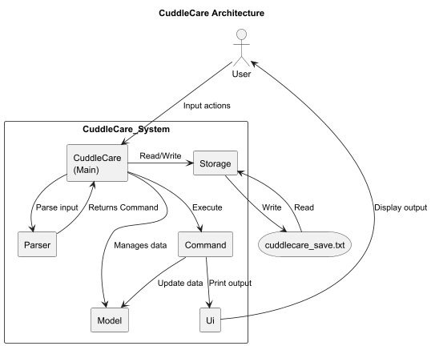

# Developer Guide

- [Acknowledgements](#acknowledgements)
- [Design](#design)
    - [Architecture](#architecture)
- [Implementation](#implementation)
    - [Feature: Add Pet](#feature-add-pet)
    - [Feature: Delete Pet](#feature-delete-pet)
    - [Feature: Edit Pet](#feature-edit-pet)
    - [Feature: List Pets](#feature-list-pets)
    - [Feature: Add Treatment](#feature-add-treatment)
    - [Feature: Delete Treatment](#feature-delete-treatment)
    - [Feature: Find Treatment](#feature-find-treatment)
    - [Feature: Filter Treatments By Date](#feature-filter-treatments-by-date)
    - [Feature: Mark a Treatment as Done](#feature-mark-a-treatment-as-done)
    - [Feature: Mark a Treatment as Not Done](#feature-mark-a-treatment-as-not-done)
    - [Feature: List All Treatments across all Pets](#feature-list-all-treatments-across-all-pets)
    - [Feature: List All Treatments of a Pet](#feature-list-all-treatments-of-a-pet)
    - [Feature: Summary of Completed Treatments](#feature-summary-of-completed-treatments)
    - [Feature: Group Treatments by Type](#feature-group-treatments-by-type)
    - [Feature: Overdue Treatments Command](#feature-overdue-treatments-command)
    - [Feature: Help Command](#feature-help-command)
    - [Feature: Bye Command](#feature-bye-command)
    - [Feature: Data Storage](#feature-saving-data-to-a-file-and-loading)
- [Appendix: Requirements](#appendix-requirements)
    - [Product scope](#product-scope)
    - [User stories](#user-stories)
    - [Non-Functional Requirements](#non-functional-requirements)
    - [Glossary](#glossary)
- [Appendix: Instructions for Manual Testing](#appendix-instructions-for-manual-testing)

***

## Acknowledgements

This Developer Guide was inspired by
the [AddressBook-Level3 (AB3) Developer Guide](https://se-education.org/addressbook-level3/DeveloperGuide.html)

***

## Design

### Architecture

The Architecture Diagram below explains the high-level design of CuddleCare.



**Main Components:**

`CuddleCare` is the entry point of the application.

- Initializes all components
- Receives user input from `Ui` and coordinates with `Parser` to create commands
- Executes commands and manages interactions between components
- At shutdown, triggers data storage through `Storage`

`Ui`: Handles all user interactions

- Displays output messages, results, and error messages to the user

`Parser`: Parses user input into executable commands

- Interprets command strings and extracts parameters
- Creates appropriate `Command` objects based on the command type
- Returns the command object to `CuddleCare` for execution

`Command`: Executes logic

- Interface implemented by all command classes (e.g., `AddPetCommand`, `DeleteTreatmentCommand`)
- Each command updates the `Model` with new data
- Prints results and messages via `Ui`

`Model`: Holds application data in memory. Some examples:

- `PetList`: Contains all pets
- `Pet`: Represents individual pets with name, species, and age
- `Treatment`: Represents medical treatments with name, date, and notes

`Storage`: Manages data

- Saves application data
- Loads existing data when the application starts

**How the architecture components interact:**

The sequence of interactions for a typical command (e.g., `add-pet n/Milo s/Dog a/3`) is:

1. `CuddleCare` reads user input
2. `CuddleCare` sends input to `Parser` for interpretation
3. `Parser` creates and returns appropriate `Command` object
4. `CuddleCare` executes the `Command`
5. `Command` updates `Model` with new data
6. `Command` prints success/error message via `Ui`
7. `CuddleCare` triggers `Storage` to save changes

***

## Implementation

### Feature: Add Pet

The diagram below shows how the `AddPetCommand` class interacts with other
components in the system.


This design follows a command-based architecture, where each command is
encapsulated in its own class implementing the `Command` interface.
`AddPetCommand` depends on the `PetList` object, which stores all registered
pets. Each `Pet` object maintains information about its name, species, and age.


When executed, the command performs the following steps:

1. Parses user input to extract the pet's name (`n/`), species (`s/`), and
   age (`a/`)
2. Validates the input fields
3. Creates a new `Pet` object with the parsed parameters
4. Adds the new pet to the pet list using `add()`
5. Handles duplicates and disregards the addition of the
   pet if the duplicate exists
6. Displays and logs activity

The `AddPetCommand` ensures that only valid and unique pets are added to the
pet list. It emphasizes input validation, duplicate prevention, and
error handling, while maintaining logging for debugging/monitoring execution.

***

### Feature: Delete Pet

This feature is built using the Command Pattern. This design decouples the invoker
(main app logic) from the operation itself by using a Command interface.
The DeletePetCommand is a concrete implementation of this interface that contains
all the logic for parsing and execution.


As shown in the class diagram above, the DeletePetCommand does not manage the list directly.
Instead, it holds a reference to a PetList instance (a "has-a" relationship,
or Aggregation) that is provided to its constructor. This use of Dependency
Injection makes the command highly testable, as the PetList can be easily mocked.

The execution flow starts when the exec method is called with the user's input.
The command parses the string to find the pet's name, then validates the input by
querying the PetList. If the syntax is correct and the pet exists, the
command instructs the PetList to perform the actual deletion. The DeletePetCommand
is also responsible for printing all relevant success or error messages to the user.

The detailed interaction between the main app (CuddleCare), DeletePetCommand, and
PetList during execution is illustrated in the sequence diagram below.


***

### Feature: Edit Pet


**Purpose**: Edit an existing pet’s properties. Only provided fields are changed.

**Command word**: `edit-pet`

**Format**

```
edit-pet n/OLD_NAME [nn/NEW_NAME] [s/SPECIES] [a/AGE]
```

**Arguments**

- `n/OLD_NAME` *(required)* – name of the pet to edit.
- `nn/NEW_NAME` *(optional)* – new name to assign.
- `s/SPECIES` *(optional)* – new species.
- `a/AGE` *(optional)* – integer age (non-negative).

**Examples**

```
edit-pet n/Milo nn/Millie a/4
edit-pet n/Lucky s/Dog
edit-pet n/Tama a/12
```

**Success behaviour**

- Finds the pet by `OLD_NAME`. Updates only the tokens present. Prints a success line with the edited pet.

**Failure cases & messages**

- Missing `n/`: prints usage line.
- Pet not found: `Pet not found.`
- No editable tokens provided (`nn/`, `s/`, `a/` all absent): `Nothing to edit.`
- `a/` not an integer: `Age must be a valid number.`

**Logging**

- INFO: start/end; edited fields.
- WARNING: invalid tokens/number format; pet missing.

***

### Feature: List Pets


**Purpose**: Display all pets maintained in memory.

**Command word**: `list-pets`

**Format**

```
list-pets
```

- Prints an enumerated list (1-based) of all pets, each rendered via `Pet#toString()`.
- If empty, prints `No pets found.`

**Behaviour**

- Iterates `PetList` from index `0..size-1` and prints `(i+1) + ". " + pet.toString()`.

**Failure cases & messages**

- None (arguments are ignored). If the list is empty, shows the friendly message above.

**Logging**

- INFO on command entry/exit; FINE for iteration count.

***

### Feature: Add Treatment

The diagram below shows how the AddTreatmentCommand class interacts with other components in the system.


The design follows a command-based architecture, where each command is encapsulated in its own class implementing the
Command interface. AddTreatmentCommand depends on the PetList object, which stores all registered pets. Each Pet object
maintains a list of Treatment objects.

When executed, the command:

1. **Parse Note**
    - Extracts everything after `note/`
    - Validates that note is not empty if `note/` tag is provided

2. **Parse Required Parameters**
    - Extracts pet name (`n/`), treatment name (`t/`), and date (`d/`)
    - Validates treatment name against `NAME_PATTERN` and length constraint
    - Parses and validates date format using `LocalDate.parse()`

3. **Validate Date Range**
    - Checks date is not more than 10 years in the past
    - Checks date is not more than 100 years in the future

4. **Retrieve Pet**
    - Fetches corresponding Pet object from PetList using `getPetByName()`
    - Throws error if pet not found

5. **Check for Duplicates**
    - Compares new treatment against existing treatments (name + date)
    - Rejects if duplicate found

6. **Add Treatment**
    - Creates new Treatment object with validated parameters
    - Adds treatment to pet's treatment list via `addTreatment()`
    - Displays confirmation message

7. **Error Handling**
    - Catches `IllegalArgumentException` for validation failures
    - Catches `DateTimeParseException` for invalid date format
    - Displays appropriate error messages via `System.out.println()`

The command validates all inputs before modifying the pet's treatment list. If the pet is not found or the date format
is invalid, appropriate error messages are displayed.

***

### Feature: Delete Treatment

The figure below shows how the DeleteTreatmentCommand interacts with other key classes in the system.


The DeleteTreatmentCommand follows a command-based architecture, where each command is encapsulated in its own class
implementing the Command interface.

When the command is executed:

1. User input is parsed to extract the pet's name (`n/`) and treatment index (`i/`)
2. Command retrieves the corresponding Pet object from the PetList using `getPetByName()`
3. Validates that the index is within valid bounds
4. Converts the 1-based user index to 0-based array index
5. Removes the treatment from the pet's list using `removeTreatment()`
6. Displays a confirmation message with the deleted treatment's name

If the pet is not found or the index is invalid, the command prints an appropriate error message.

#### Design Considerations

Alternative 1 (current choice): Use index-based deletion.

Pros:

* Always deletes exactly one specific treatment.
* Easier for user to type out.

Cons:

* Requires users to know or look up the index.

Alternative 2: Use treatment name for deletion.

Pros:

* More intuitive for users who remember treatment names.

Cons:

* Ambiguous when multiple treatments have similar names.
* Requires additional confirmation steps.

***

### Feature: Find Treatment

The FindCommand allows users to search for treatments across all pets by matching a keyword against treatment names.
The search is case-insensitive and uses substring matching.

The sequence diagram below illustrates the execution flow of the find treatment command:


Implementation
The find treatment mechanism is facilitated by `FindTreatmentCommand`. It performs a case-insensitive keyword search
across all treatments for all pets in the system. The search uses substring matching, allowing partial keyword matches.

Key operations:

* `PetList#getAllPets()` — Retrieves all pets in the system.
* `Pet#getTreatments()` — Gets the treatment list for each pet.
* String comparison using `toLowerCase()` and `contains()` for matching.

Command format: `find KEYWORD`

When the command is executed:

1. User input is parsed to extract the search keyword
2. The keyword is validated (must not be empty)
3. Command retrieves all pets from `PetList`
4. For each pet, the command iterates through its treatments
5. Each treatment name is checked against the keyword (case-insensitive substring match)
6. Matching treatments are collected with their pet names and dates
7. Results are displayed to the user, or a "No treatments found" message if no matches

***

### Feature: Filter Treatments By Date

The FilterTreatmentCommand enables users to view all treatments that fall within a specified date range across all pets
in the system.

The sequence diagram below shows the execution flow when filtering treatments by date:


The filter treatments by date range feature is facilitated by `FilterTreatmentCommand`. It allows users to view all
treatments that fall within a specified date range across all pets in the system.

The implementation involves the following operations:

* `PetList#getAllPets()` — Retrieves all pets.
* `Pet#getTreatments()` — Gets treatments for filtering.
* `Treatment#getDate()` — Retrieves the treatment date for comparison.
* Date comparison using `LocalDate#isAfter()` and `LocalDate#isBefore()`.

Command format: `treatment-date from/START_DATE to/END_DATE`

When the command is executed:

1. User input is parsed to extract start date and end date
2. Both dates are validated using `LocalDate.parse()`
3. The command checks that start date is not after end date
4. Command retrieves all pets from `PetList`
5. For each pet, the command iterates through its treatments
6. Each treatment's date is checked against the date range (inclusive)
7. Matching treatments are collected and displayed to the user

***

### Feature: Mark a treatment as done


**Purpose**: Mark a specific treatment (by per‑pet local index) as completed.

**Command word**: `mark`

**Format**

```
mark n/PET_NAME i/INDEX
```

- `n/PET_NAME` *(required)* – the pet to operate on.
- `i/INDEX` *(required)* – 1‑based index into that pet’s treatment list.

**Examples**

```
mark n/Milo i/2
```

**Success behaviour**

- Sets `Treatment#setCompleted(true)` for the selected treatment. Prints a confirmation containing pet name and
  treatment info.

**Failure cases & messages**

- Missing `n/` or `i/`: prints usage line.
- Pet not found: `No such pet.`
- `i/` not an integer: `Invalid index.`
- Index out of bounds: `Invalid treatment index.`

**Logging**

- INFO on success with (petName, index).
- WARNING for invalid input or lookups.

***

### Feature: Mark a treatment as not done


**Purpose**: Unmark a specific treatment (by per‑pet local index) as not completed.

**Command word**: `unmark`

**Format**

```
unmark n/PET_NAME i/INDEX
```

**Examples**

```
unmark n/Milo i/2
```

**Success behaviour**

- Sets `Treatment#setCompleted(false)` for the selected treatment.

**Failure cases & messages**

- Same validation and messages as `mark`.

**Logging**

- Same as `mark`.

***

### Feature: List All Treatments across all pets

#### Design

The diagram below shows how the `ListAllTreatmentsCommand` class interacts with other components in the system.


The design follows a command-based architecture, where each command is encapsulated in its own class
implementing the `Command` interface.\
`ListAllTreatmentsCommand` depends on the PetList object, which stores all registered pets. Each `Pet`
object maintains a list of `Treatment` objects.

When executed, the command iterates through each `Pet` in the `PetList`, retrieves its treatments,
and formats them into displayable strings. The command then sorts all treatments by their dates in
ascending order before printing them to the console.


***

### Feature: List All Treatments of a pet

#### Design

The figure below shows how the `ListPetTreatmentsCommand` interacts with other key classes in the system.


The `ListPetTreatmentsCommand` follows a command-based architecture, where each command is encapsulated
in its own class implementing the `Command` interface.

When the command is executed:

1. user input is parsed to extract the pet’s name (n/PET_NAME)
2. command retrieves the corresponding Pet object from the PetList using getPetByName().
3. then obtains the list of treatments from the Pet object via getTreatments().
4. displays the list of treatments in a numbered format. If the pet has no logged treatments,
   or if the pet is not found, the command prints a message.

The sequence diagram is given below to show the execution of the list all treatments of a pet command.


***

### Feature: Summary of Completed Treatments

The figure below shows how the `SummaryCommand` interacts with other key classes in the system.


When the command is executed:

1. user input is parsed to extract the date range using the `DateUtils` class.
2. validates the date range to ensure that the fromDate is not after the toDate.
3. iterates through the list of pets in the PetList and collects all Treatment records that:
    * Fall within the specified date range, and
    * Have been marked as completed
4. displays the summary report using the Ui class

The sequence diagram is given below to show the execution of the summary command.


***

### Feature: Group Treatments by type


**Purpose**: Group treatments by **type** across the dataset, then print each group with its members.

**Command word**: `group-treatments`

**Format**

```
group-treatments [n/PET_NAME]
```

**Examples**

```
group-treatments [n/Milo]
```

**Success behaviour**

- Flattens `(pet, treatment)` rows across `PetList`, then buckets by type using `extractType(treatment)`.
- Prints each type header `== Type ==` followed by entries.

**Failure cases & messages**

- No treatments anywhere: `No treatments logged.`

**Notes**
- Grouping uses **literal string matching**.  
  Avoid quotation marks in treatment names — for example,  
  `"Vaccination A"` will be treated as a **different group** from `Vaccination A`.
- The grouping key is derived from the **first token** of each treatment name  
  (e.g. `"Vaccine A"` → `Vaccine`; tokens are split by space or colon).
- type is case-insensitive, in this case, `VACCINATION` = `vaccination`

**Logging**

- INFO summarising bucket counts; FINE for per‑bucket sizes.

***

### Feature: Overdue Treatments Command


The `OverdueTreatmentsCommand` displays all treatments that are overdue for pets. It can show overdue treatments for a
specific pet if the pet name is provided, or for all pets if no name is given. A treatment is considered overdue if it
is **not completed** and its scheduled date is **before today**.

This command follows the **Command Pattern**, encapsulating all logic related to listing overdue treatments in a
dedicated class implementing the `Command` interface. It depends on a `PetList` instance, injected via its constructor,
and optionally allows a custom date for testing purposes.

**Execution flow**:


1. The command is executed via `exec(String args)`.
2. Parses optional argument `n/PET_NAME` to determine if the user wants overdue treatments for a specific pet.
3. Validates the argument:
    - Prints syntax error if the input format is invalid.
    - Prints a message if the specified pet does not exist.
4. Determines the current date (or uses the provided test date for testing).
5. Collects all overdue treatments:
    - Iterates through the relevant pet(s).
    - Filters treatments where `isCompleted()` is `false` and `getDate()` is before the current date.
6. Prints the overdue treatments in a readable format, including:
    - Pet name (if displaying for all pets)
    - Treatment name
    - Scheduled date
    - Number of days overdue
7. If no overdue treatments exist, prints a friendly message.

**Design Considerations**:

- Supports both **all pets** and **single pet** modes using streams.
- Uses **Dependency Injection** for `PetList` and optional test date.
- Separates filtering logic (`getOverdueTreatmentsForPet`) from printing logic (`printOverdueTreatments`) for clarity
  and testability.
- Handles empty pet list and missing pet gracefully.
- Logs execution steps, invalid inputs, and command success for monitoring.

**Logging**:

- `INFO` when command is executed with arguments.
- `INFO` for invalid arguments or missing pets.
- `INFO` when no overdue treatments are found.
- `INFO` on successful execution with results printed.

***

### Feature: Help Command

  
The HelpCommand provides users with guidance on available commands in the application. It can either display all
commands grouped by category or show detailed information for a specific command using the optional `c/COMMAND_NAME`
argument.

This feature follows the **Command Pattern**, encapsulating all help-related logic in its own class that implements the
`Command` interface. The HelpCommand depends on a map of all commands (`Map<String, Command>`) that is set via
`setCommands(Map)`.

**Execution flow**:


1. The command is executed via `exec(String args)`.
2. Parses optional argument `c/COMMAND_NAME` to determine if help for a specific command is requested.
3. Validates the argument:
    - If the syntax is invalid, prints the help command syntax.
    - If a specific command is requested but not found, prints an error message.
4. If a valid command name is provided, prints detailed information including:
    - Command name
    - Category
    - Long description
    - Syntax
5. If no command name is provided, prints all commands grouped by their category, respecting a predefined order (
   `General`, `Pet`, `Treatment`) and sorting remaining categories alphabetically.

**Design Considerations**:

- Uses **Dependency Injection** to receive the `commandsMap`, making it testable.
- Categorizes commands dynamically using streams and collectors.
- Supports optional arguments via a tag-based parsing mechanism (`c/COMMAND_NAME`).
- Logs command execution, invalid syntax, and missing commands for monitoring.

**Logging**:

- `INFO` on command execution, printing all commands or specific command.
- `INFO` on invalid syntax or missing command.
- Maintains clear separation of concerns between argument parsing, categorization, and printing.

***

### Feature: Bye Command


The `ByeCommand` allows users to **exit the application** gracefully. When executed, it prints a farewell message and
terminates the program.

This command follows the **Command Pattern**, encapsulating the exit behavior in a dedicated class implementing the
`Command` interface. It does not require any dependencies or arguments.

**Execution flow**:


1. The command is executed via `exec(String args)`.
2. Prints a farewell message to the console: `Bye bye, Have a wonderful day ahead :)`
3. Terminates the application using `System.exit(0)`.

**Design Considerations**:

- Simple, single-responsibility command.
- Ignores any arguments passed, ensuring a consistent exit behavior.
- Logs or monitoring is not necessary due to its terminal effect.
- Follows a **General** category, as it pertains to application lifecycle.

**Logging**:

- N/A — the command immediately exits the application after printing the message.

***

### Feature: Saving Data to a file and loading


The `Storage` class is responsible for **persisting all Pet and Treatment data** to
a file and **loading it back** into the application at startup. It ensures that data
in memory (`PetList`) is synchronized with the on-disk save file.

**Responsibilities**

- Load pets and treatments from a save file at application startup (`load()`)
- Save pets and treatments back to the save file after every successful command (`save()`)
- Validate and sanitize data while reading from the save file
- Handle file I/O errors and log warnings or errors

**Key Components**

- `filePath`: location of the save file
- `pets`: reference to the `PetList` object that stores all pets
- Logger: logs `INFO`, `WARNING`, and `SEVERE` messages during load/save

**Interactions**

1. `CuddleCare` (or main program) calls `Storage.load()` → populates `PetList`.
2. Commands modifying pets/treatments call `Storage.save()` → writes current state to file.
3. `Storage` directly manipulates `Pet` and `Treatment` objects.

**Implementation Details**

* Loading Data (`load()`)
  1. Check if the save file exists; if not, log `INFO` and skip loading.
  2. Read all lines from the file into a list.
  3. Separate the data into two sections:
      - `# Pets` → lines representing pets
      - `# Treatments` → lines representing treatments
  4. **Process Pets** (`processPet()`):
      - Split line by `|` into name, species, age
      - **Sanitize:**
          - Remove non-alphabetic characters in name/species
          - Trim whitespace
          - Limit length (name ≤ 20, species ≤ 30)
      - **Validate:**
          - Non-empty name and species
          - Age is numeric and ≤ 200 (and is changed to 200 if age is over 200)
      - Add to `PetList` and `petMap` for reference
      - Log warnings for malformed lines or duplicates
  5. **Process Treatments** (`processTreatment()`):
      - Split line into `petName | treatmentName | date | completed | note`
      - Sanitize name and treatment
      - **Validate:**
          - Non-empty pet name and treatment name
          - Date is parseable; if invalid, skip
          - Date clamped between `MAX_TREATMENT_PAST_YEAR` and `MAX_TREATMENT_FUTURE_YEAR`
      - Store in a temporary `treatmentsMap` until all pets are loaded
  6. **Assign Treatments** (`loadTreatments()`):
      - Match treatments to their pets using `petMap`
      - Skip duplicates
      - Log warnings for treatments referencing missing pets

* Saving Data (`save()`)

  1. Ensure the parent directory of the save file exists (`createSaveDirectory()`)
  2. Write the pet section:
      ```
      # Pets
      name | species | age
     ```
  3. Write the treatment section:
      ```
      # Treatments
      petName | treatmentName | date | completed | note
     ```
  4. Use FileWriter with UTF-8 encoding
  5. Log success or errors

**Validation & Sanitization**

* Pet:
  1. Name: trimmed, alphabetic only, max 20 chars
  2. Species: trimmed, alphabetic only, max 30 chars 
  3. Age: numeric, absolute value, max 200
* Treatment:
  1. Name: trimmed, alphabetic only, max 50 chars
  2. Date: parsed to LocalDate, clamped to ±100 years
  3. Completed: boolean parsed safely 
  4. Note: optional

* Duplicates are skipped, with a WARNING logged

**Error Handling**
* Missing file → log INFO, continue with empty data
* Malformed lines → log WARNING, skip
* IOException during read/write → log SEVERE, print error to console

**Design Considerations**
* Atomicity: Writes are done in a single operation per section, reducing risk of partial saves.
* Decoupling: Storage interacts directly with PetList but doesn’t implement any business logic.
* Extensibility: Could be extended for other formats (JSON/XML) without changing how CuddleCare uses it.
* Logging: Provides traceable feedback for debugging invalid data entries.

***

## Appendix: Requirements

### Product scope

#### Target user profile

Tech Savvy, young adults with pets

Young adults who are comfortable with technology, enjoy using CLI, and are dedicated pet owners looking for efficient
ways to monitor and manage their pets’ daily care and well-being.

#### Value proposition

Tracks pets’ daily routines, medications, and health. Provides reminders and activity logs locally, keeping pet care
organized and ensuring pets stay healthy and happy.

### User Stories

| Version | As a ... | I want to ...                                                                              | So that I can ...                                             |
|---------|----------|--------------------------------------------------------------------------------------------|---------------------------------------------------------------|
| v1.0    | user     | add a new pet with its name, species, and age                                              | manage and record its treatments later on                     |
| v1.0    | user     | view a list of all my pets                                                                 | quickly confirm which ones are being tracked                  |
| v1.0    | user     | delete a pet                                                                               | remove records for pets I no longer need to track             |
| v1.0    | user     | add a treatment record for a pet with a type and date (e.g., “rabies vaccine, 2025-09-04”) | log when it happened                                          |
| v1.0    | user     | view all treatments for a specific pet                                                     | see its full health history in one place                      |
| v1.0    | user     | list all treatments across pets sorted by date                                             | see a unified timeline                                        |
| v1.0    | user     | mark a treatment as completed                                                              | keep track of which treatments have already been done         |
| v2.0    | user     | group treatments by type in the output (e.g., all vaccines together)                       | analyze care patterns across pets                             |
| v2.0    | user     | edit a pet’s basic details                                                                 | update information if it changes (e.g., age, name correction) |
| v2.0    | user     | search for treatments                                                                      | easily find specific treatment records                        |
| v2.0    | user     | filter treatments by date range                                                            | review what happened during a specific period                 |
| v2.0    | user     | attach a note to a treatment entry                                                         | log extra details (e.g., vet name, reaction, dosage)          |
| v2.0    | user     | run a command to see overdue treatments                                                    | know which ones I haven’t completed yet                       |
| v2.0    | user     | view a summary of treatments completed in a chosen time range (e.g., last 30 days)         | quickly review recent care                                    |
| v2.0    | user     | save data in the app                                                                       | don't have to add it everytime i open it                      |

### Non-Functional Requirements

1. The application should work on any mainstream OS as long as it has Java 17 installed

### Glossary

* *Mainstream OS* - Windows, Linux, MacOS
* *Pet* - An individual animal added by the user
* *Treatment* - A health-related action or procedure scheduled or completed for a pet
* *Species* - Describes the type of animal associated with each pet entry

***

## Appendix: Instructions for manual testing

**Listing Pets**

1. Listing all pets
    - Prerequisites: At least one pet has been added using the `add-pet` command.
    - Test case: `list-pets`
        - Expected: All pets in the system are listed with their name, species, and age.

**Editing a Pet**

1. Renaming and Updating age
    - Prerequisites: A Pet named `Milo` exists, added using `add-pet n/Milo s/Dog a/3`
    - Test case: `edit-pet n/Milo nn/Millie a/4`
        - Expected: Pet `Milo` is renamed to `Millie`, and age is updated to 4. (Use `list-pets` to verify details are
          updated.)
    - Other incorrect edit commands to try: `edit-pet`, `edit-pet n/Milo nn/`

**Marking and Unmarking Treatments**

1. Marking a treatment as completed
    - Prerequisites: A pet `Millie` with at least one treatment (e.g.,
      `add-treatment n/Millie t/Vaccine A d/2024-01-10`).
    - Test case: `mark n/Millie i/1`
        - Expected: Treatment at index 1 is marked as completed and displayed with `[X]`.
    - Other incorrect mark commands to try: `mark`, `mark n/Millie`


2. Unmarking a completed treatment
    - Prerequisites: A pet `Millie` with at least one completed treatment
    - Test case: `unmark n/Millie i/1`
        - Expected: Treatment at index 1 is unmarked and displayed with `[ ]`.
    - Other incorrect unmark commands to try: `unmark`, `unmark i/x`

**Grouping Treatments**

1. Grouping Treatments by type for a pet
    - Prerequisites: A pet `Millie` with multiple treatments of varying types (e.g., Vaccine, Checkup).
    - Test case: `group-treatments n/Millie`
        - Expected: Treatments for `Millie` are grouped and displayed under headers by type.


2. Grouping Treatments by type across all pets
    - Prerequisites: More than 1 pet added in the list and multiple treatments of varying types for each pet in the
      list.
    - Test case: `group-treatments`
        - Expected: All treatments across pets are listed, grouped by type and sorted by date in ascending order

**Listing All Treatments**

1. Listing all treatments in the system
    - Prerequisites: Multiple pets and treatments exits.
    - Test case: `list-all-treatments`
        - Expected: All treatments are displayed in ascending order by date.

**Listing a Pet's Treatments**

1. Listing all treatments for a specific pet
    - Prerequisites: Pet `Millie` exists with at least one treatment.
    - Test case: `list-treatments n/Millie`
        - Expected: All treatments tagged under `Millie` are listed with correct details.

**Summarising Treatments**

1. Viewing summary of completed treatments within a date range
    - Prerequisites: At least one pet exists with multiple treatments, some of which are marked as completed.
    - Test case: `summary from/2025-01-01 to/2025-12-30`
        - Expected: Only treatments marked as completed within the specified date range are listed.
    - Other incorrect summary commands to try: `summary`, `summary from/2025-10-10`

**Deleting a pet**

1. Deleting an existing pet
    - Prerequisites: Pet `Millie` exists.
    - Test case: `delete-pet n/Millie`
        - Expected: Pet `Millie` is deleted. Success Message displayed. (Use `list-pets` to verify pet `Millie` is no
          longer in the pet list.
    - Other incorrect delete commands to try: `delete-pet`

**Viewing Commands**

1. Viewing available commands and syntax
    - Prerequisites: Application is running.
    - Test case: `help`
        - Expected: A list of all available commands is displayed.
    - Test case: `help c/add-pet`
        - Expected: Detailed syntax and description for `add-pet` command are shown.

**Viewing Overdue Treatments**

1. Displaying overdue treatments
    - Prerequisites: Pet `Millie` exists with multiple treatments, some overdue and some upcoming (e.g.,
      `add-treatment n/Millie t/Vaccine d/2025-10-05`,  `add-treatment n/Millie t/Checkup d/2025-10-08`,
      `add-treatment n/Millie t/Something d/2026-10-07`).
    - Test case: `overdue-treatments`
        - Expected: Only pending treatments with past dates are displayed
    - Test case: `mark n/Millie i/1` then `overdue-treatments`
        - Expected: Marked treatments are excluded from the overdue list.

**Exiting the Application**

1. Using the bye command
    - Prerequisites: Application is running.
    - Test case: `bye`
        - Expected: Application displays `Bye bye, Have a wonderful day ahead :)` and terminates successfully.
